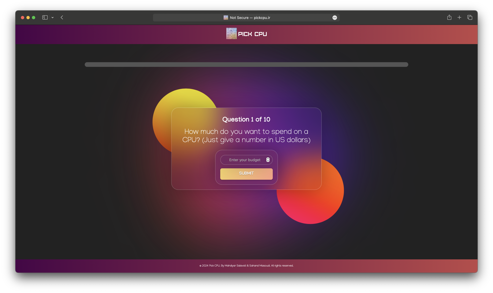

# PickCPU

PickCPU is a web tool that helps users find the ideal CPU for their needs. 

## How It Works

PickCPU works by asking users a series of questions about their computing needs. These questions cover various aspects such as the type of tasks they perform, their budget, and their performance requirements.

Once the user answers all the questions, PickCPU processes these responses. It compares the user's needs with the features of various CPU models. The comparison is done using a similarity calculation, which takes into account the importance of each feature.

If a CPU model that matches the user's needs and fits within their budget is found, PickCPU recommends this model to the user. If no perfect match is found within the budget, PickCPU suggests close alternatives that are slightly over the budget.

## How to Use

You can use PickCPU in two ways:

1. **Online:** Visit pickcpu.ir to use the tool online.
2. **Locally:** If you want to run it locally, follow these steps:
    - Install XAMPP.
    - Place all the release files in the `XAMPP/htdocs` directory.
    - Go to `localhost` in your web browser and find the project.

